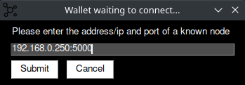

<div id="top"></div>

![Contributors][contributors-shield]
[![Forks][forks-shield]][forks-url]
[![Stargazers][stars-shield]][stars-url]
[![Issues][issues-shield]][issues-url]
[![MIT License][license-shield]][license-url]
[![LinkedIn][linkedin-shield]][linkedin-url]


<!-- PROJECT LOGO -->
<br />
<div align="center">
  <a href="https://github.com/ock666/serpentcoin">
    
  </a>

  <h3 align="center">Serpentcoin</h3>

  <p align="center">
    Version Alpha 0.0.1
    <br />
    <a href="https://github.com/ock666/serpentcoin"><strong>Explore the docs »</strong></a>
    <br />
    <br />
    ·
    <a href="https://github.com/ock666/serpentcoin/issues">Report Bug</a>
    ·
    <a href="https://github.com/ock666/serpentcoin/issues">Request Feature</a>
  </p>
</div>


<!-- TABLE OF CONTENTS -->
<details>
  <summary>Table of Contents</summary>
  <ol>
    <li>
      <a href="#about-the-project">About The Project</a>
      <ul>
        <li><a href="#built-with">Built With</a></li>
      </ul>
    </li>
    <li>
      <a href="#getting-started">Getting Started</a>
      <ul>
        <li><a href="#prerequisites">Prerequisites</a></li>
        <li><a href="#installation">Installation</a></li>
      </ul>
    </li>
    <li><a href="#usage">Usage</a></li>
    <li><a href="#API">API</a></li>
    <li><a href="#features">Features</a></li> 
    <li><a href="#roadmap">Roadmap</a></li>
    <li><a href="#contributing">Contributing</a></li>
    <li><a href="#license">License</a></li>
    <li><a href="#contact">Contact</a></li>
    <li><a href="#acknowledgments">Acknowledgments</a></li>
  </ol>
</details>


<!-- ABOUT THE PROJECT -->
## About The Project


A blockchain written in python which outputs and reads chain data from a json file. 

The code was adapted from the following tutorial and expanded upon.
> https://hackernoon.com/learn-blockchains-by-building-one-117428612f46


Here's why:
* To expand my coding abilities and tackle new novel problems
* For fun and to learn how blockchains work by creating my own
* Something to do in my off time

I hope to make this project the best it can be, and I hope others find it interesting or may wish to contribute. I'm not a professional developer or expert so the code may not be 100% efficient, But I do welcome contributions to the project.

<p align="right">(<a href="#top">back to top</a>)</p>


### Built With

* [Flask](https://flask.palletsprojects.com/)
* [Pycryptodome](https://pypi.org/project/pycryptodome/)
* [Requests](https://pypi.org/project/requests/)
* [PySimpleGUI](https://pypi.org/project/PySimpleGUI/)
* [qrcode](https://pypi.org/project/qrcode/)

<p align="right">(<a href="#top">back to top</a>)</p>


<!-- GETTING STARTED -->
## Getting Started

Be sure to read this readme in full before trying to get set up or submitting any issues to the repo.

### Prerequisites

Install the requirements with
* pip
  ```sh
  pip install -r requirements.txt
  ```

### Installation

1. Clone the repo
   ```sh
   git clone https://github.com/ock666/serpentcoin.git
   ```
2. Install the requirements
   ```sh
   pip install -r requirements.txt
   ```
3. You may need to install Tkinter as a dependency for PySimpleGUI
   ```
   apt install python3-tk
   ```
4. If you receive an error stating python cannot import Image, you may also need to install Pillow as a dependency for qrcode. 
    ```shell
    pip3 -U install Pillow
    ```
5. Run blockchain.py to generate chain.json and wallet.json.
   ```sh
   python3 blockchain.py
   ```


<p align="right">(<a href="#top">back to top</a>)</p>


<!-- USAGE EXAMPLES -->
## Usage

* Start blockchain.py node, (and provide it a port number to run on) to generate wallet.json, and chain.json.
```
python3 blockchain.py
```
* If a node already exists, upon start up you can connect to nodes configured in the data/config.json file to receive the chain and mempool from upstream.
* To begin mining, start miner.py and enter the IP address of a node.
```
python3 miner.py
```
* Miners will now attempt to forge new blocks.
* Congrats! the blockchain network is now set up!
* Upon miners receiving rewards, wallet.py can be used to send coins to other addresses on the network.
* any transactions sent from the wallet.py or pool.py will confirm in the next block.

<p align="right">(<a href="#top">back to top</a>)</p>

<!-- API -->

## API Calls


The blockchain can be interacted with using either Postman or simple cURL commands to send POST/GET requests to the API to either:

````
1. Request the blockchain history /chain 		\\ GET
````

``````
2. Register a new node /nodes/register 			// POST
``````


<p align="right">(<a href="#top">back to top</a>)</p>

<!-- FEATURES -->

## Features

## blockchain.py
This is the main blockchain node that everything will connect to, including other blockchain.py nodes, as well as pool.py, and wallet.py. The blockchain will verify funds, hashes, and signatures and forge blocks with new transactions waiting to be confirmed in the mem-pool when a miner or pool finds the correct proof for the next block.
### Block Solution Broadcast
The blockchain now has the capability to share newly mined block with other nodes, receiving nodes will perform 
validation on the new block to confirm the proof
### Signature Validation
Nodes will verify the public key hex and the signature to verify a transaction. if the signature verification fails, 
the transaction is denied.
### Balance Verification
Nodes will check the balance of an address from the blockchain, if a sender has insufficient balance.
The transaction will be denied.
### Hash Verification
The blockchain will check the hashes of any broadcasted transactions or blocks to ensure authenticity in transmission.
### Transaction Broadcast
Upon receiving and verifying a new transaction nodes will broadcast the transaction to other nodes,
receiving nodes will check if the transaction is already in their mem-pool, perform their own validation; and either accept or deny the transaction.
### Difficulty Epoch
Every 10 blocks the blockchain will either scale mining difficulty up or down to attempt to reach an epoch time of 5 minutes.

## miner.py
This is the miner for the blockchain that will attempt to forge new blocks by solving proofs that output to a defined hash structure; which will solve for the next block. The miner has two modes, solo and pool.

## wallet.py
This is the GUI wallet for ease of sending transactions to the blockchain. Simply input the address of the recipient, the amount to send, and hit OK. If you have enough funds, and dont have an existing transaction in the mem-pool; your transaction will be broadcasted to the network and confirmed in the next block.
### GUI (wallet.py)
a simple GUI to send transactions to the blockchain node without having to interact with a terminal.

When The wallet starts it will ask you to enter the address of a node:



After the wallet has successfully connected to a blockchain node it will display the following. From this interface a user may send transactions or view their transaction history.


### Transaction History
view your transaction history within the wallet


<p align="right">(<a href="#top">back to top</a>)</p>

<!-- ROADMAP -->
## Roadmap

- [x] Add chain persistence through json
- [x] Add block and transaction broadcasting
- [x] Add signature and hash validation
- [x] Add Balance Verification
- [x] Develop Wallet
- [X] Improved difficulty algorithm; doesnt scale so aggressively anymore.
- [ ] Add pool mining - Removed as of Alpha 0.0.1, will be readded upon improvement
  - [ ] Improve pool mining efficiency
- [x] Implement mining difficulty scaling to ensure consistent block times
- [ ] Node persistence - WIP
    - [x] implement code to allow for nodes to remember each other after they have been shut down
    - [ ] implement a validation algorithm through signatures to ensure a node is who they say they are
- [ ] Improve overall code robustness - WIP
    - [ ] Fix up some of the response codes and json messages
    - [ ] code clean up, bug fixes, and optimisation
    - [ ] unit test more of the code
- [ ] Transaction Fees - WIP
- [ ] Implement blockchain explorer (WIP) [Explorer](https://github.com/ock666/serpentcoin-explorer)
    - [ ] develop method to call chain API from a node and enter the values into a database
    - [ ] develop backend to process chain data from database and analyse it
    - [ ] develop frontend for a user to check address and transactions within blocks
- [ ] develop basic mobile wallet app
    - [ ] create method to generate QR codes from addresses
    - [ ] allow the app to scan an address from qr code and plug that address into a new transaction window


See the [open issues](https://github.com/othneildrew/Best-README-Template/issues) for a full list of proposed features (and known issues).

<p align="right">(<a href="#top">back to top</a>)</p>


<!-- CONTRIBUTING -->
## Contributing

Contributions are what make the open source community such an amazing place to learn, inspire, and create. Any contributions you make are **greatly appreciated**.

If you have a suggestion that would make this project better, please fork the repo and create a pull request. You can also simply open an issue with the tag "enhancement".
Don't forget to give the project a star! Thanks again!

1. Fork the Project
2. Create your Feature Branch (`git checkout -b feature/AmazingFeature`)
3. Commit your Changes (`git commit -m 'Add some AmazingFeature'`)
4. Push to the Branch (`git push origin feature/AmazingFeature`)
5. Open a Pull Request

<p align="right">(<a href="#top">back to top</a>)</p>


<!-- LICENSE -->
## License

Distributed under the MIT License. See `LICENSE.txt` for more information.

<p align="right">(<a href="#top">back to top</a>)</p>


<!-- CONTACT -->
## Contact

Your Name - [Oskar Petersen](https://www.linkedin.com/in/oskar-petersen-39a849185/) - oskargjerlevpetersen@gmail.com

Project Link: [https://github.com/ock666/serpentcoin](https://github.com/ock666/serpentcoin)

<p align="right">(<a href="#top">back to top</a>)</p>


<!-- ACKNOWLEDGMENTS -->
## Acknowledgments

* [Satoshi Nakamoto](https://bitcoin.org/bitcoin.pdf)
* [Daniel van Flymen](https://hackernoon.com/learn-blockchains-by-building-one-117428612f46)
* [river.com](https://river.com/learn/how-bitcoin-mining-pools-work/)
* [Choose an Open Source License](https://choosealicense.com)
* [Img Shields](https://shields.io)
* [GitHub Pages](https://pages.github.com)

<p align="right">(<a href="#top">back to top</a>)</p>


<!-- MARKDOWN LINKS & IMAGES -->
<!-- https://www.markdownguide.org/basic-syntax/#reference-style-links -->
[contributors-shield]: https://img.shields.io/github/contributors/ock666/serpentcoin.svg?style=for-the-badge
[contributors-url]: https://github.com/ock666/serpentcoin/graphs/contributors
[forks-shield]: https://img.shields.io/github/forks/ock666/serpentcoin.svg?style=for-the-badge
[forks-url]: https://github.com/ock666/serpentcoin/network/members
[stars-shield]: https://img.shields.io/github/stars/ock666/serpentcoin.svg?style=for-the-badge
[stars-url]: https://github.com/ock666/serpentcoin/stargazers
[issues-shield]: https://img.shields.io/github/issues/ock666/serpentcoin.svg?style=for-the-badge
[issues-url]: https://github.com/ock666/serpentcoin/issues
[license-shield]: https://img.shields.io/github/license/ock666/serpentcoin?style=for-the-badge
[license-url]: https://github.com/ock666/serpentcoin/blob/main/LICENSE.txt
[linkedin-shield]: https://img.shields.io/badge/-LinkedIn-black.svg?style=for-the-badge&logo=linkedin&colorB=555
[linkedin-url]: https://www.linkedin.com/in/oskar-petersen-39a849185/
