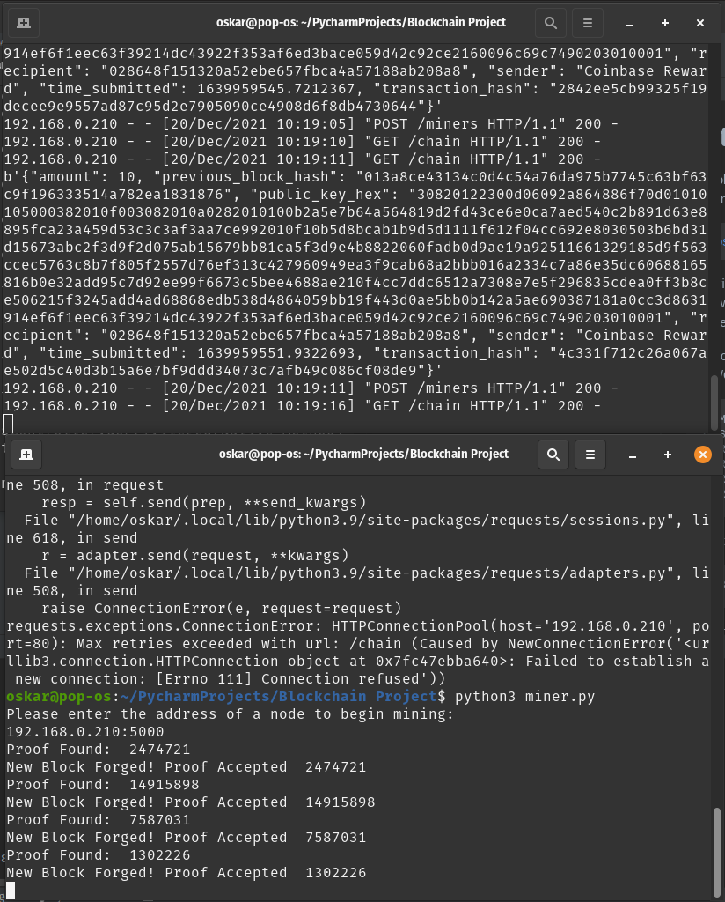

# Python-Blockchain

A simple blockchain which outputs and reads chain data from a json file. The code was adapted from the following tutorial
> https://hackernoon.com/learn-blockchains-by-building-one-117428612f46

The original code was not persistant between restarts of the program; and any values stored in the chain table would be lost.
I thought that wasn't very cash money and learning to work with JSON objects sounded like fun.

The blockchain can be interacted with using either Postman or simple cURL commands to send POST/GET requests to the API to either:

````
1. Request the blockchain history /chain 		\\ GET
````

``````
2. Register a new node /nodes/register 			// POST
``````

``````````
3. Resolve/update node chain data /nodes/resolve 			\\ GET
``````````


install the requirements with

````
pip3 install -r requirements.txt
````

Feel free to reimplement the code however you please.

### chain.json / wallet.json
Included with the repo is is a data directory containing a placeholder chain.json and wallet.json.
feel free to delete these files as the program will regenerate the directory and files if they are not present,
any changes to the hardcoded genesis block will require a new chain to be made regardless.
## Features
### Block Solution Broadcast
The blockchain now has the capability to share newly mined block with other nodes, receiving nodes will perform 
validation on the new block to confirm the proof
### Signature Validation
Nodes will verify the public key hex and the signature to verify a transaction. if the signature verification fails, 
the transaction is denied.
### Balance Verification
Nodes will check the balance of an address from the blockchain, if a sender has insufficient balance.
The transaction will be denied.
### Transaction Broadcast
Upon receiving and verifying a new transaction nodes will broadcast the transaction to other nodes,
receiving nodes will check if the transaction is already in their mem-pool, perform their own validation; and either accept or deny the transaction.
### GUI wallet (wallet.py)
a simple GUI wallet to send transactions to the blockchain node.


### Miner (miner.py)
a miner which gets the last block and performs proof of work, submits the proof to a node upon completion for the block reward


### Transaction History
view your transaction history within the wallet


Future Feature List

Node Persistence


```
TO DO

implement signature validation within amount validation for extra security

continue work on the wallet.py, The GUI is much better than CLI, but it could use some touches || WIP

Fix up some of the response codes and json messages between the wallet.py and blockchain.py

Integrate code to allow for nodes, whats a blockchain without decentralisation? DONE [x]

Block and transaction broadcast on network || DONE [x]

balance checking with public/private keys, UTXO's? DONE [x]

a fully hectic PoW algorithm (PoS actually stands for piece of shit)
Also, finding a more efficient and randomised way of finding proofs so it isnt just the fastest node to find the proof everytime.

an actual personal use case? apart from learning?  || WIP

code clean up, it works but its kind of a mess right now haha || WIP
```


