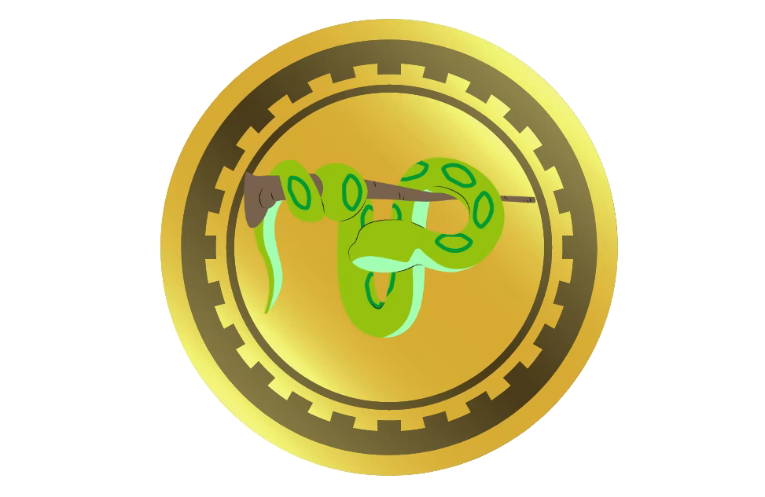

<div id="top"></div>

![Contributors][contributors-shield]
[![Forks][forks-shield]][forks-url]
[![Stargazers][stars-shield]][stars-url]
[![Issues][issues-shield]][issues-url]
[![MIT License][license-shield]][license-url]
[![LinkedIn][linkedin-shield]][linkedin-url]


<!-- PROJECT LOGO -->
<br />
<div align="center">
  <a href="https://github.com/ock666/python-blockchain">
    
  </a>

  <h3 align="center">Python Blockchain</h3>

  <p align="center">
    A blockchain coded in python
    <br />
    <a href="https://github.com/ock666/python-blockchain"><strong>Explore the docs »</strong></a>
    <br />
    <br />
    ·
    <a href="https://github.com/ock666/python-blockchain/issues">Report Bug</a>
    ·
    <a href="https://github.com/ock666/python-blockchain/issues">Request Feature</a>
  </p>
</div>


<!-- TABLE OF CONTENTS -->
<details>
  <summary>Table of Contents</summary>
  <ol>
    <li>
      <a href="#about-the-project">About The Project</a>
      <ul>
        <li><a href="#built-with">Built With</a></li>
      </ul>
    </li>
    <li>
      <a href="#getting-started">Getting Started</a>
      <ul>
        <li><a href="#prerequisites">Prerequisites</a></li>
        <li><a href="#installation">Installation</a></li>
      </ul>
    </li>
    <li><a href="#usage">Usage</a></li>
    <li><a href="#features">Features</a></li>
    <li><a href="#API">API Calls</a></li>
    <li><a href="#roadmap">Roadmap</a></li>
    <li><a href="#contributing">Contributing</a></li>
    <li><a href="#license">License</a></li>
    <li><a href="#contact">Contact</a></li>
    <li><a href="#acknowledgments">Acknowledgments</a></li>
  </ol>
</details>


<!-- ABOUT THE PROJECT -->
## About The Project


A blockchain written in python which outputs and reads chain data from a json file. 

The code was adapted from the following tutorial and expanded upon.
> https://hackernoon.com/learn-blockchains-by-building-one-117428612f46


Here's why:
* To expand my coding abilities and tackle new novel problems
* For fun and to learn how blockchains work by creating my own

I hope to make this project the best it can be, and I hope others find it interesting or may wish to contribute. I'm not a professional developer or expert so the code may not be 100% efficient, But I do welcome contributions to the project.

<p align="right">(<a href="#top">back to top</a>)</p>


### Built With

This section should list any major frameworks/libraries used to bootstrap your project. Leave any add-ons/plugins for the acknowledgements section. Here are a few examples.

* [Flask](https://flask.palletsprojects.com/)
* [Pycryptodome](https://pypi.org/project/pycryptodome/)
* [Requests](https://pypi.org/project/requests/)
* [PySimpleGUI](https://pypi.org/project/PySimpleGUI/)


<p align="right">(<a href="#top">back to top</a>)</p>


<!-- GETTING STARTED -->
## Getting Started

Be sure to read this readme in full before trying to get set up or submitting any issues to the repo.

### Prerequisites

Install the requirements with
* pip
  ```sh
  pip install -r requirements.txt
  ```

### Installation

_Below is an example of how you can instruct your audience on installing and setting up your app. This template doesn't rely on any external dependencies or services._

1. Clone the repo
   ```sh
   git clone https://github.com/ock666/python-blockchain.git
   ```
2. Install the requirements
   ```sh
   pip install -r requirements.txt
   ```
3. Run blockchain.py to generate chain.json and wallet.json.
   ```sh
   python3 blockchain.py
   ```

<p align="right">(<a href="#top">back to top</a>)</p>


<!-- USAGE EXAMPLES -->
## Usage

* Start blockchain.py node, (and provide it a port number to run on) to generate wallet.json, and chain.json.
```
python3 blockchain.py
```
* If a node already exists call the /nodes/register API on the new node the receive the chain (explained further below in the readme).
* Call the /nodes/register API on the existing node to tell it about the new blockchain.py node so that any blocks confirmed by each node can be shared.
* Start pool.py and connect it to the IP and port number of a blockchain.py node, pool.py will always run on port 6000.
```
python3 pool.py
```
* To begin mining, start miner.py and select the mode.
```
python3 miner.py
```
* If you are solo mining you should connect miner.py directly to the blockchain node to receive proofs for example 192.168.0.25:5000.
* if you are pool mining you should connect miner.py to the pool.py node, and specify port 6000 for example 192.168.0.20:6000.
* Miners will now be attempting to solve proofs either through a pool or solo.
* Congrats! the blockchain network is now set up!
* Upon miners receiving rewards, wallet.py can be used to send coins to other addresses on the network.
* any transactions sent from the wallet.py or pool.py will confirm in the next block.

<p align="right">(<a href="#top">back to top</a>)</p>

<!-- API -->

## API Calls


The blockchain can be interacted with using either Postman or simple cURL commands to send POST/GET requests to the API to either:

````
1. Request the blockchain history /chain 		\\ GET
````

``````
2. Register a new node /nodes/register 			// POST
``````

``````````
3. Resolve/update node chain data /nodes/resolve 			\\ GET
``````````


Nodes will also resolve their chain when registering a new node.

<p align="right">(<a href="#top">back to top</a>)</p>

<!-- FEATURES -->

## Features

## blockchain.py
This is the main blockchain node that everything will connect to, including other blockchain.py nodes, as well as pool.py, and wallet.py. The blockchain will verify funds, hashes, and signatures and forge blocks with new transactions waiting to be confirmed in the mem-pool when a miner or pool finds the correct proof for the next block.
### Block Solution Broadcast
The blockchain now has the capability to share newly mined block with other nodes, receiving nodes will perform 
validation on the new block to confirm the proof
### Signature Validation
Nodes will verify the public key hex and the signature to verify a transaction. if the signature verification fails, 
the transaction is denied.
### Balance Verification
Nodes will check the balance of an address from the blockchain, if a sender has insufficient balance.
The transaction will be denied.
### Hash Verification
The blockchain will check the hashes of any broadcasted transactions or blocks to ensure authenticity in transmission.
### Transaction Broadcast
Upon receiving and verifying a new transaction nodes will broadcast the transaction to other nodes,
receiving nodes will check if the transaction is already in their mem-pool, perform their own validation; and either accept or deny the transaction.

## miner.py
This is the miner for the blockchain that will attempt to forge new blocks by solving proofs that output to a defined hash structure; which will solve for the next block. The miner has two modes, solo and pool.
### Solo Mining
In this mode the miner will connect directly to the blockchain node to obtain the last blocks proof, and attempt to compute what the next proof is.
Note: currently when solo mining, a miner will not see an update in the last proof until it has finished finding a correct proof.
### Pool Mining
miner.py will pool together hashes with other miners, upon a miner finding a valid proof it will submit the proof to the pool, and each miner will receive a share of the coinbase reward.
Note: currently pool mode is must slower at solving blocks than solo mode, this is a known issue/limitation of the code currently.


## pool.py
This is the pool node which miners configured to pool mode will connect to. pool.py verifies all submitted tested proofs from miners and tallys the total number submitted by each miner. After a block is solved, will calculate each miners share of the coinbase reward from the amount of valid shares they submitted in that given block time. Once a miner reachs 100 coins they will be eligible for a payout. Once per block the pool will submit 1 payout transaction to a miner with over 100 coins in unpaid reward balance, this transaction should confirm in the next block.
### Share verification
pool.py will verify submitted shares to check if the proofs in a share (last_proof, proof) produce the hash value provided to the pool by a miner. When a share is verified to be correct it is tallied in a dictionary with the miners address as the key.
### Reward distribution
upon pool.py receiving a valid proof and forging a block, the pool will begin to calculate the share of the coinbase reward for each miner and add the value to a dictionary with the miners address as the key. When a miners balance exceeds the payout threshold the pool will submit a transaction to the blockchain to pay the miner their accumulated unpaid reward.


## wallet.py
This is the GUI wallet for ease of sending transactions to the blockchain. Simply input the address of the recipient, the amount to send, and hit OK. If you have enough funds, and dont have an existing transaction in the mem-pool; your transaction will be broadcasted to the network and confirmed in the next block.
### GUI (wallet.py)
a simple GUI to send transactions to the blockchain node without having to interact with a terminal.

### Transaction History
view your transaction history within the wallet


<p align="right">(<a href="#top">back to top</a>)</p>

<!-- ROADMAP -->
## Roadmap

- [x] Add chain persistence through json
- [x] Add block and transaction broadcasting
- [x] Add signature and hash validation
- [x] Add Balance Verification
- [x] Develop Wallet
- [x] Add pool mining
- [ ] Improve pool mining efficiency
- [ ] Node persistence
    - [ ] implement code to allow for nodes to remember each other after they have been shut down
    - [ ] implement a validation algorithm through signatures to ensure a node is who they say they are
- [ ] Improve overall code robustness
    - [ ] Fix up some of the response codes and json messages
    - [ ] code clean up, bug fixes, and optimisation
    - [ ] unit test more of the code
- [ ] Implement blockchain explorer
    - [ ] develop method to call chain API from a node and enter the values into a database
    - [ ] develop backend to process chain data from database and analyse it
    - [ ] develop frontend for a user to check address and transactions within blocks
- [ ] develop basic mobile wallet app
    - [ ] create method to generate QR codes from addresses
    - [ ] allow the app to scan an address from qr code and plug that address into a new transaction window


See the [open issues](https://github.com/othneildrew/Best-README-Template/issues) for a full list of proposed features (and known issues).

<p align="right">(<a href="#top">back to top</a>)</p>


<!-- CONTRIBUTING -->
## Contributing

Contributions are what make the open source community such an amazing place to learn, inspire, and create. Any contributions you make are **greatly appreciated**.

If you have a suggestion that would make this project better, please fork the repo and create a pull request. You can also simply open an issue with the tag "enhancement".
Don't forget to give the project a star! Thanks again!

1. Fork the Project
2. Create your Feature Branch (`git checkout -b feature/AmazingFeature`)
3. Commit your Changes (`git commit -m 'Add some AmazingFeature'`)
4. Push to the Branch (`git push origin feature/AmazingFeature`)
5. Open a Pull Request

<p align="right">(<a href="#top">back to top</a>)</p>


<!-- LICENSE -->
## License

Distributed under the MIT License. See `LICENSE.txt` for more information.

<p align="right">(<a href="#top">back to top</a>)</p>


<!-- CONTACT -->
## Contact

Your Name - [Oskar Petersen](https://www.linkedin.com/in/oskar-petersen-39a849185/) - oskargjerlevpetersen@gmail.com

Project Link: [https://github.com/ock666/python-blockchain](https://github.com/ock666/python-blockchain)

<p align="right">(<a href="#top">back to top</a>)</p>


<!-- ACKNOWLEDGMENTS -->
## Acknowledgments

Use this space to list resources you find helpful and would like to give credit to. I've included a few of my favorites to kick things off!

* [Satoshi Nakamoto](https://bitcoin.org/bitcoin.pdf)
* [Daniel van Flymen](https://hackernoon.com/learn-blockchains-by-building-one-117428612f46)
* [river.com](https://river.com/learn/how-bitcoin-mining-pools-work/)
* [Choose an Open Source License](https://choosealicense.com)
* [Img Shields](https://shields.io)
* [GitHub Pages](https://pages.github.com)

<p align="right">(<a href="#top">back to top</a>)</p>


<!-- MARKDOWN LINKS & IMAGES -->
<!-- https://www.markdownguide.org/basic-syntax/#reference-style-links -->
[contributors-shield]: https://img.shields.io/github/contributors/ock666/python-blockchain.svg?style=for-the-badge
[contributors-url]: https://github.com/ock666/python-blockchain/graphs/contributors
[forks-shield]: https://img.shields.io/github/forks/ock666/python-blockchain.svg?style=for-the-badge
[forks-url]: https://github.com/ock666/python-blockchain/network/members
[stars-shield]: https://img.shields.io/github/stars/ock666/python-blockchain.svg?style=for-the-badge
[stars-url]: https://github.com/ock666/python-blockchain/stargazers
[issues-shield]: https://img.shields.io/github/issues/ock666/python-blockchain.svg?style=for-the-badge
[issues-url]: https://github.com/ock666/python-blockchain/issues
[license-shield]: https://img.shields.io/github/license/ock666/python-blockchain.svg?style=for-the-badge
[license-url]: https://github.com/ock666/python-blockchain/blob/master/LICENSE.txt
[linkedin-shield]: https://img.shields.io/badge/-LinkedIn-black.svg?style=for-the-badge&logo=linkedin&colorB=555
[linkedin-url]: https://www.linkedin.com/in/oskar-petersen-39a849185/
